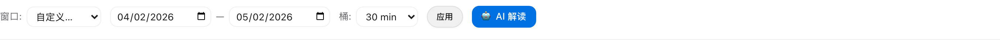

# token-usage

> Local-first analytics for your Claude Code token consumption.

**English** · [简体中文](./README.zh-CN.md)

A [Claude Code](https://claude.com/claude-code) skill that reads JSONL transcripts under `~/.claude/projects/`, aggregates per model / project / day, and surfaces patterns and AI-generated interpretations through three interfaces:

- **CLI** — `count_tokens.py` for one-shot reports in any time range
- **Browser dashboard** — charts + a Patterns panel (Markov / ACF / change-point) + an in-page **🤖 AI 解读** button
- **`analyze.py` CLI** — exports the same Patterns analysis to standalone HTML / Markdown / JSON

Zero dependencies (pure stdlib, no `numpy` / `pandas` / `chart.js` server-side). Chart.js is loaded from CDN by the browser only.

---

## Screenshots

| | |
|---|---|
|  |  |
| **Main dashboard** — KPIs, daily trend, by-model, top-10 projects, realtime | **Patterns panel** — auto profile + KPIs + ACF + hour-of-day + day-of-week + change-point + Markov 3-state + workflow |
|  |  |
| **🤖 AI 解读** — Markdown report rendered inline (Sonnet 4.6, ~30s) | **Custom range toolbar** — pick a `from`/`to` date, choose any bucket size, hit apply |

---

## Why

Claude Code's built-in `~/.claude/stats-cache.json` lags by one day and gives you only totals. This skill goes further:

- **Today's data, accurate to the second** (parses transcripts directly, dedupes by `message.id` with field-wise max, splits 5-minute vs 1-hour ephemeral cache writes for billing-equivalent token estimates).
- **Per-model / per-project / per-day breakdowns**.
- **Time-series patterns**: when do you actually use Claude Code? Are you bursty or steady? When did your usage spike? Is your "active session" sticky?
- **AI-generated narrative**: feed the patterns into the local `claude` CLI and get a 500–800 字 Chinese interpretation of your usage profile + cost-saving recommendations.

---

## Install

```bash
git clone https://github.com/WholeNightCoding/token-usage ~/.claude/skills/token-usage
```

The skill is auto-discovered by Claude Code. Just open Claude Code in any project and ask:

> *"How many tokens did I use today?"*
> *"打开 token 监控板"*

…or run any of the scripts directly (see below).

### Requirements

- Python 3.11+ (stdlib only, no `pip install`)
- macOS / Linux / WSL
- The browser dashboard works in any modern browser (Chart.js loads from jsDelivr)
- The **AI 解读** feature requires the [`claude` CLI](https://claude.com/claude-code) to be in `$PATH`

---

## Usage

### CLI — one-shot reports

```bash
# defaults
python3 ~/.claude/skills/token-usage/scripts/count_tokens.py

# named windows
python3 ~/.claude/skills/token-usage/scripts/count_tokens.py --today
python3 ~/.claude/skills/token-usage/scripts/count_tokens.py --yesterday
python3 ~/.claude/skills/token-usage/scripts/count_tokens.py --this-week
python3 ~/.claude/skills/token-usage/scripts/count_tokens.py --this-month

# rolling windows
python3 ~/.claude/skills/token-usage/scripts/count_tokens.py --last 7d
python3 ~/.claude/skills/token-usage/scripts/count_tokens.py --last 12h

# explicit range, with per-day breakdown
python3 ~/.claude/skills/token-usage/scripts/count_tokens.py \
  --from 2026-04-01 --to 2026-04-30 --by-day

# JSON output for piping
python3 ~/.claude/skills/token-usage/scripts/count_tokens.py --json
```

Output columns: `MODEL | MSGS | INPUT | OUTPUT | CACHE_READ | CACHE_CREATE | TOTAL`, plus a grand total and a billing-equivalent input-token estimate using weights `input=1×, cache_read=0.1×, cache_create_5m=1.25×, cache_create_1h=2×, output=5×`.

### Browser dashboard

```bash
python3 ~/.claude/skills/token-usage/dashboard/server.py
# → opens http://127.0.0.1:8787/ in your default browser
```

What you get:

- **4 KPI cards** — total / billing-equiv / USD estimate / last-1h rate
- **Daily trend** — stacked bar chart by model, with totals labeled
- **By model / Top 10 projects** — doughnut + bar
- **Realtime** — last-Nh line chart, auto-refreshes every 10s, configurable bucket size (1 min → 4 hour)
- **Patterns panel** — see below
- **Detail table** — filterable model × project rows

### Patterns panel

A second-tier analytics view inside the dashboard:

- **Window selector**: 3 / 7 / 14 / 30 / 60 / 90 days, or a custom from / to date range
- **Bucket selector**: 15 min → 1 day
- **8 cards**:
  - 用法画像 (auto-derived archetype labels: 晚高峰 / 突发型 / 强 24h 周期 / 高黏性 / High 沉浸 / etc.)
  - KPIs (Gini / Burstiness B / top-5% / Stickiness)
  - ACF (autocorrelation at 7 lags)
  - Hour-of-day distribution (independent of bucket size)
  - Day-of-week distribution
  - Change-point detection (binary segmentation + BIC)
  - Markov 3-state transition matrix (Idle / Low / High)
  - Workflow shape (5 inferred patterns)

Every technical metric has a `?` icon with a hover tooltip explaining the math + how to read it.

### 🤖 AI 解读

A button at the top of the Patterns panel calls the local `claude` CLI to produce a 500–800 字 Chinese interpretation of your patterns. The report renders inline as Markdown directly into the page, so you can print the whole thing (data + analysis + AI commentary) as one document.

```bash
# the dashboard's button calls this internally
GET /api/interpret?days=7&bucket=1800
```

Pin a different model with:
```bash
TOKEN_USAGE_LLM_MODEL=claude-opus-4-7 python3 dashboard/server.py
```

### Standalone Patterns reports — `analyze.py`

Same analysis, no browser:

```bash
# print to terminal
python3 ~/.claude/skills/token-usage/scripts/analyze.py

# export
python3 ~/.claude/skills/token-usage/scripts/analyze.py --html report.html
python3 ~/.claude/skills/token-usage/scripts/analyze.py --markdown report.md
python3 ~/.claude/skills/token-usage/scripts/analyze.py --json report.json

# custom window
python3 ~/.claude/skills/token-usage/scripts/analyze.py --days 30 --bucket 1h
```

---

## Methodology

The Patterns panel computes 11 indicators from established statistical / information-theory methods. All implemented in pure Python under `analysis/`.

| Method | Purpose | Module |
|---|---|---|
| Descriptive stats + percentiles | strength, distribution shape | `features.py` |
| Goh-Barabási burstiness `B` | how far from Poisson | `features.py` |
| Fano factor | variance / mean | `features.py` |
| Gini coefficient | concentration / inequality | `features.py` |
| Top-X% concentration | heavy-tail evidence | `features.py` |
| ACF (multi-lag autocorrelation) | short-term persistence + periodicity | `features.py` |
| Hour-of-day & day-of-week | circadian + weekly cycles | `seasonal.py` |
| Run-length analysis | session / idle durations | `features.py` |
| Shannon entropy (binary) | active/idle predictability | `features.py` |
| Binary segmentation + BIC | change-point detection | `changepoint.py` |
| Discrete Markov chain + stationary distribution | state transitions, dwell times, stickiness | `markov.py` |

---

## Architecture

```
token-usage/
├── SKILL.md                       Skill manifest (Claude Code reads this)
├── scripts/
│   ├── token_stats.py             Core: parse / dedupe / aggregate transcripts
│   ├── count_tokens.py            CLI for time-range token counts
│   └── analyze.py                 CLI for Patterns analysis + report export
├── analysis/                       Pure-Python analytics (no deps)
│   ├── features.py                Descriptive / burstiness / Gini / ACF / runs / entropy
│   ├── seasonal.py                Hour-of-day, day-of-week
│   ├── changepoint.py             Binary segmentation + BIC
│   ├── markov.py                  2-state and 3-state Markov chains
│   └── report.py                  Renderers: terminal / Markdown / HTML / JSON
├── dashboard/
│   ├── server.py                  Stdlib http.server, JSON API + static
│   └── static/                    HTML / CSS / vanilla-JS dashboard
└── menubar/
    └── app.py                     macOS menubar (rumps), optional
```

---

## Data the dashboard reads

Everything comes from `~/.claude/projects/**/*.jsonl` — the JSONL transcripts that Claude Code writes for every session. The skill never leaves your machine; the only outbound call is the local `claude` CLI subprocess for the AI 解读 button.

---

## For Claude Code contributors

If you open this repo in Claude Code, [`CLAUDE.md`](./CLAUDE.md) is auto-loaded into Claude's context. It tells Claude Code:

- the codebase map (where each module lives + what it does)
- hard rules (zero pip deps, no telemetry, don't mutate user transcripts, Chinese UI strings stay Chinese, etc.)
- common dev tasks (run dashboard, add a new statistical method, edit the AI prompt)
- battle scars from prior work (org slug PascalCase, LLM call timeout, dedup-by-max for streaming snapshots, etc.)

This file is the convention every Claude Code project should ship with — it makes Claude Code's first edit on the repo dramatically more accurate.

---

## License

MIT — see [LICENSE](LICENSE).

---

## Contributing

Issues and PRs welcome. The codebase is intentionally small (pure stdlib, ~3500 lines total) so extension is easy. See [CLAUDE.md](./CLAUDE.md) for conventions.
