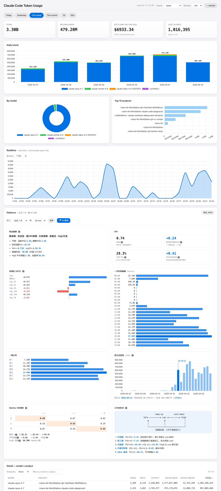
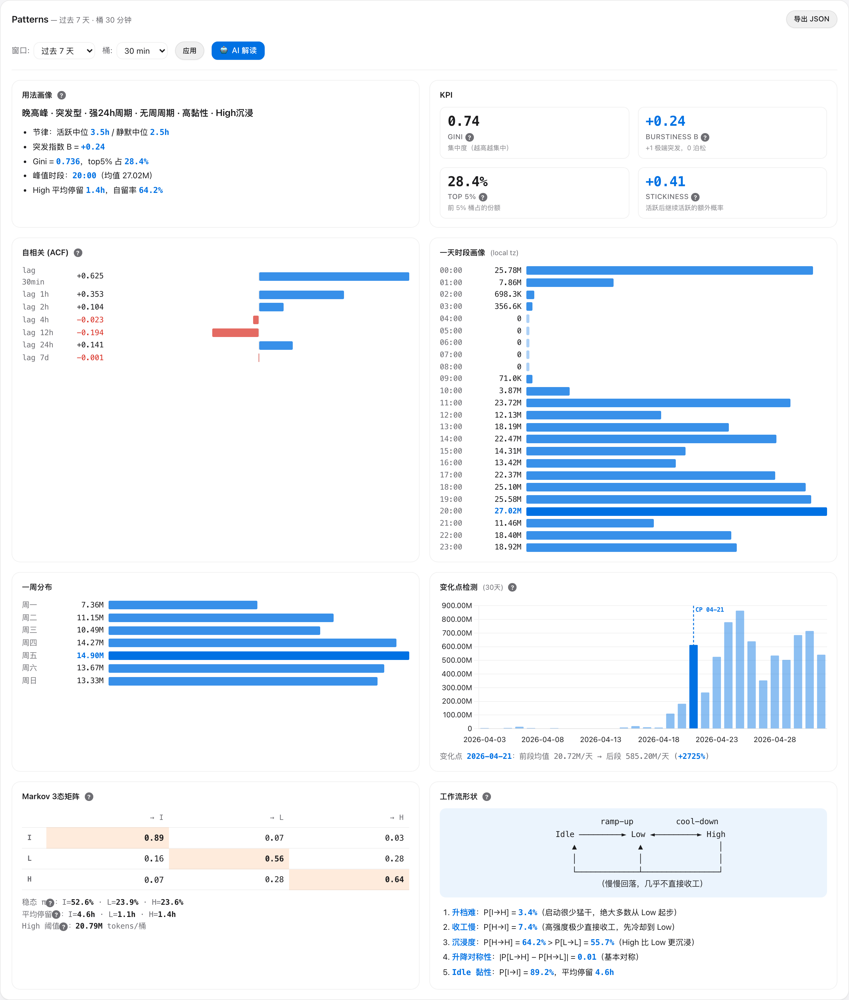
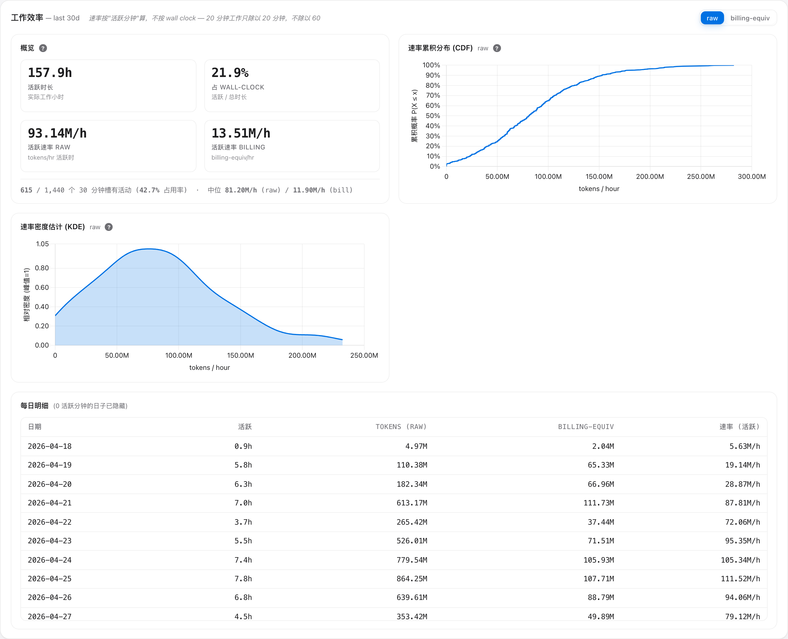
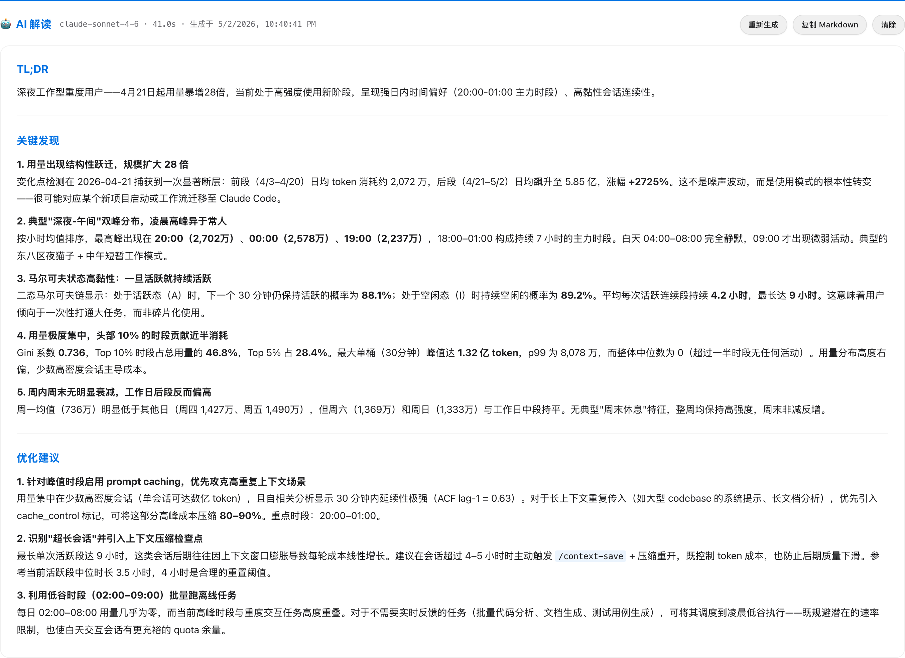

# token-usage

> Claude Code token 用量本地化分析工具。

[English](./README.md) · 简体中文

一个 [Claude Code](https://claude.com/claude-code) skill —— 直接读 `~/.claude/projects/` 下的 JSONL transcript，按 model / project / day 聚合，并通过四个界面把数据变成可读的洞察：

- **CLI** — `count_tokens.py` 任意时间区间一次性出报告
- **浏览器仪表板** — 图表 + **工作效率面板**（按活跃分钟算吞吐 + CDF/KDE 分布图）+ **Patterns 面板**（Markov / ACF / 变化点检测）+ 内嵌 **🤖 AI 解读** 按钮
- **`analyze.py` CLI** — 把 Patterns 分析导出成独立 HTML / Markdown / JSON
- **`work_efficiency.py` CLI** — 同样的活跃分钟吞吐分析，纯终端输出

零 pip 依赖（纯 stdlib，连 numpy/pandas 都没有）。Chart.js 只在浏览器端通过 CDN 加载。

---

## 截图

| | |
|---|---|
|  |  |
| **主仪表板** — KPI 卡、Daily trend、by-model、Top 10 projects、Realtime | **Patterns 面板** — 自动画像 + KPI + ACF + 一天时段 + 一周分布 + 变化点 + Markov 3 态 + 工作流形状 |


**工作效率面板** — 活跃时长 vs wall-clock、按活跃分钟算的吞吐速率（30 分钟槽位速率的 CDF + KDE 分布图）、每日明细。**20 分钟工作只除以 20 分钟，不除以 60**，速率反映你真在敲键盘时的节奏，不被两头摸鱼时间稀释。`raw / billing-equiv` 切换会同步重画两张图。


**🤖 AI 解读** — 本地 `claude` CLI 生成的 Markdown 内嵌渲染（Sonnet 4.6，约 30 秒）

---

## 为什么做这个

Claude Code 自带的 `~/.claude/stats-cache.json` 有两个不爽的地方：**滞后一天**，**只有汇总**。这个工具：

- **今天的数据精确到秒**（直接解析 transcript，按 `message.id` 字段级 max 去重，区分 5 分钟和 1 小时 ephemeral 缓存写入价格）
- **按 model / project / day 拆分**
- **时序模式分析**：你什么时候真的在用 Claude Code？是突发型还是稳态？哪天开始用量爆发？session 黏性如何？
- **AI 自动解读**：把所有指标喂给本地 `claude` CLI，让它生成一段 500-800 字的中文洞察 + 成本优化建议

---

## 安装

```bash
git clone https://github.com/WholeNightCoding/token-usage ~/.claude/skills/token-usage
```

Claude Code 会自动发现这个 skill。打开任意项目，问它：

> *「我今天用了多少 token？」*
> *「打开 token 监控板」*

…或者直接跑下面的脚本。

### 系统要求

- Python 3.11+（纯 stdlib，无需 `pip install`）
- macOS / Linux / WSL
- 浏览器仪表板支持任何现代浏览器（Chart.js 从 jsDelivr 加载）
- **AI 解读** 需要 [`claude` CLI](https://claude.com/claude-code) 在 `$PATH` 中

---

## 用法

### CLI — 一次性报告

```bash
# 默认值
python3 ~/.claude/skills/token-usage/scripts/count_tokens.py

# 命名窗口
python3 ~/.claude/skills/token-usage/scripts/count_tokens.py --today
python3 ~/.claude/skills/token-usage/scripts/count_tokens.py --yesterday
python3 ~/.claude/skills/token-usage/scripts/count_tokens.py --this-week
python3 ~/.claude/skills/token-usage/scripts/count_tokens.py --this-month

# 滚动窗口
python3 ~/.claude/skills/token-usage/scripts/count_tokens.py --last 7d
python3 ~/.claude/skills/token-usage/scripts/count_tokens.py --last 12h

# 自定义日期范围 + 按天拆分
python3 ~/.claude/skills/token-usage/scripts/count_tokens.py \
  --from 2026-04-01 --to 2026-04-30 --by-day

# JSON 输出（管道用）
python3 ~/.claude/skills/token-usage/scripts/count_tokens.py --json
```

输出列：`MODEL | MSGS | INPUT | OUTPUT | CACHE_READ | CACHE_CREATE | TOTAL`，外加总计和按权重 `input=1×, cache_read=0.1×, cache_create_5m=1.25×, cache_create_1h=2×, output=5×` 算的「计费等效输入 token」估算。

### 浏览器仪表板

```bash
python3 ~/.claude/skills/token-usage/dashboard/server.py
# → 自动打开 http://127.0.0.1:8787/
```

包含：

- **4 张 KPI 卡** — 总量 / 计费等效 / 美元估算 / 最近 1 小时速率
- **Daily trend** — 按 model 堆叠的柱状图，柱顶标总计
- **By model / Top 10 projects** — 甜甜圈 + 柱状
- **Realtime** — 最近 N 小时折线图，每 10 秒自动刷新，桶大小可选（1 min → 4 hour）
- **工作效率面板** — 见下
- **Patterns 面板** — 见下
- **Detail 表** — 可过滤的 model × project 行

### macOS 菜单栏 app（一键启动）

不想每次敲命令？可以构建一个原生菜单栏 app：

```bash
bash ~/.claude/skills/token-usage/macos/build_app.sh
```

它用 `swiftc`（需装 Xcode Command Line Tools）编译一个小 Swift app，装 **Token
Usage.app** 到 `/Applications`（Spotlight 能搜、可拖进 Dock）。常驻顶部菜单栏，图标是柱状图：

- **启动** — 服务没跑就先拉起，再打开浏览器
- **打开面板** — 重新打开仪表板（服务没跑会先拉起）
- **停止服务** — 停掉后台服务，app 仍留在菜单栏
- **退出** — 停服务 **并** 退出 app，不留任何后台进程

"服务在不在跑"以**谁在端口上 `LISTEN`** 为准（`lsof -iTCP:<port> -sTCP:LISTEN`），不靠进程名匹配——某个命令行里恰好含 `server.py` 字样的无关/残留进程**不会**被误判成"在跑"。服务改了或想换图标就重跑构建脚本。构建可复现：python 路径、skill 路径都在构建时解析，不把任何 host 相关假设静默写死。

### 工作效率面板

跟 Patterns 面板答的是两个不同的问题：**"我真在敲键盘的时候，吞吐到底有多快？"**。Wall-clock 平均会糊掉这点——如果你工作 20 分钟、idle 40 分钟，token 除以 60 看起来就像慢吞吞的一小时。这个面板除以 20。

- **4 张 KPI 卡** — 活跃时长、占 wall-clock 比例、活跃时段 raw 吞吐、活跃时段 billing-equiv 吞吐
- **CDF 图** — 30 分钟槽位速率的经验累积分布（x = tokens/hour，y = `P(speed ≤ x)`）。**y 轴直接读分位数**：找 50% 对应的 x 就是中位速率
- **KDE 图** — 同一组速率的高斯核密度估计（Silverman 带宽 + IQR fallback，归一化到峰值 = 1）。**读形状**：单峰 vs 双峰、瘦钟形 vs 长尾
- **每日明细表** — 日期 / 活跃时长 / token / billing / 活跃时速率，最高速率的天高亮
- **`raw / billing-equiv` 切换**（面板级）—— 两张图同步换坐标轴。`raw` 数所有 input/output/cache token；`billing-equiv` 按 Anthropic 计价权重折算（cache_read × 0.1，cache_create_5m × 1.25，cache_create_1h × 2，output × 5），x 轴跟实际花费成正比

最小聚合粒度是 30 分钟槽 —— 一个槽的速率 = `槽内 token / 槽内活跃分钟数 × 60`。**活跃分钟** = 任意分钟有 token 消耗。**活跃槽** = 至少含 1 个活跃分钟的 30 分钟槽。

同一份分析也支持纯终端：

```bash
python3 ~/.claude/skills/token-usage/scripts/work_efficiency.py 30   # 最近 30 天
python3 ~/.claude/skills/token-usage/scripts/work_efficiency.py 7    # 最近 7 天
```

仪表板背后的接口：
```bash
GET /api/efficiency?range=30d
GET /api/efficiency?from=2026-04-01&to=2026-04-30
```

### Patterns 面板

仪表板内的二级分析视图：

- **窗口选择器**：3 / 7 / 14 / 30 / 60 / 90 天，或自定义起止日期
- **桶大小选择器**：15 min → 1 day
- **8 张卡**：
  - 用法画像（自动推断的标签：晚高峰 / 突发型 / 强 24h 周期 / 高黏性 / High 沉浸 等）
  - KPI（Gini / Burstiness B / top-5% / Stickiness）
  - ACF 自相关（7 个 lag）
  - 一天时段画像（独立于桶大小）
  - 一周分布
  - 变化点检测（binary segmentation + BIC）
  - Markov 3 态转移矩阵（Idle / Low / High）
  - 工作流形状（5 个推断出的模式）

每个技术指标旁边都有 `?` 图标，悬停弹窗解释数学含义和读法。

### 🤖 AI 解读

Patterns 面板顶部的按钮，点击调用本地 `claude` CLI 生成一份 500-800 字的中文洞察。报告作为 Markdown 内嵌渲染到页面里，所以可以把整页（数据 + 分析 + AI 评论）打印成一份完整文档。

```bash
# 仪表板按钮内部调用的接口
GET /api/interpret?days=7&bucket=1800
```

切换模型：

```bash
TOKEN_USAGE_LLM_MODEL=claude-opus-4-7 python3 dashboard/server.py
```

### 独立 Patterns 报告 — `analyze.py`

同样的分析，不需要浏览器：

```bash
# 终端打印
python3 ~/.claude/skills/token-usage/scripts/analyze.py

# 导出
python3 ~/.claude/skills/token-usage/scripts/analyze.py --html report.html
python3 ~/.claude/skills/token-usage/scripts/analyze.py --markdown report.md
python3 ~/.claude/skills/token-usage/scripts/analyze.py --json report.json

# 自定义窗口
python3 ~/.claude/skills/token-usage/scripts/analyze.py --days 30 --bucket 1h
```

---

## 方法论

Patterns 面板用 11 个来自经典统计 / 信息论的指标，全部在 `analysis/` 下用纯 Python 实现。

| 方法 | 用途 | 模块 |
|---|---|---|
| 描述统计 + 分位数 | 强度、分布形状 | `features.py` |
| Goh-Barabási 突发指数 `B` | 比泊松突发多少 | `features.py` |
| Fano factor | 方差 / 均值 | `features.py` |
| Gini 系数 | 集中度 / 不平等 | `features.py` |
| top-X% 集中度 | 重尾证据 | `features.py` |
| ACF（多 lag 自相关） | 短期持续性 + 周期性 | `features.py` |
| 一天时段 + 一周分布 | 昼夜 + 周节律 | `seasonal.py` |
| Run-length 分析 | session / 静默期长度 | `features.py` |
| Shannon 熵（二元） | 活跃/闲的可预测性 | `features.py` |
| Binary segmentation + BIC | 变化点检测 | `changepoint.py` |
| 离散马尔可夫链 + 稳态分布 | 状态转移、平均停留、黏性 | `markov.py` |

---

## Research playgrounds（研究探索页）

放未成形的研究想法的地方。每个文件都是单文件 HTML，直接 `open` 就能玩，不依赖 build / CDN。等某个想法从这里"毕业"到正式 metric，再迁进 `scripts/` 或 `dashboard/`。

| Playground | 探索的问题 |
|---|---|
| [`release-potential.html`](./docs/research/release-potential.html) | 你 token 产出还能释放多少倍？把潜力拆成 时间 × 并发 两个轴，ceiling 用历史 P95 实证导出（不是平均也不是 max），并按项目熟悉度分桶。滑杆 + 预设可玩。 |

打开方式：`open ~/.claude/skills/token-usage/docs/research/release-potential.html`，或拖进任意浏览器。毕业流程见 [`docs/research/README.md`](./docs/research/README.md)。

---

## 目录结构

```
token-usage/
├── SKILL.md                       Skill manifest（Claude Code 自动加载）
├── CLAUDE.md                      给 Claude Code 看的项目说明书（约定 + 导航）
├── scripts/
│   ├── token_stats.py             核心：解析 / 去重 / 聚合 transcript
│   ├── count_tokens.py            CLI：时间范围内 token 计数
│   ├── analyze.py                 CLI：Patterns 分析 + 报告导出
│   └── work_efficiency.py         库 + CLI：按活跃分钟算吞吐 + CDF/KDE 数据源
├── analysis/                       纯 Python 分析模块（无依赖）
│   ├── features.py                描述 / 突发 / Gini / ACF / runs / 熵
│   ├── seasonal.py                Hour-of-day, day-of-week
│   ├── changepoint.py             Binary segmentation + BIC
│   ├── markov.py                  2 态和 3 态马尔可夫链
│   └── report.py                  渲染器：终端 / Markdown / HTML / JSON
├── dashboard/
│   ├── server.py                  Stdlib http.server，JSON API + 静态文件
│   └── static/                    HTML / CSS / 原生 JS 仪表板
├── docs/
│   ├── screenshots/               README 截图 + capture.ts
│   └── research/                  交互式研究探索页（单文件 HTML）
└── menubar/
    └── app.py                     macOS 菜单栏（rumps，可选）
```

---

## 数据来源

所有数据来自 `~/.claude/projects/**/*.jsonl` —— Claude Code 每个 session 写入的 JSONL transcript。这个 skill 不会把数据离开你的电脑；唯一的对外调用是 AI 解读按钮调用本地 `claude` CLI 子进程。

---

## License

MIT — 见 [LICENSE](LICENSE)。

---

## 贡献

欢迎 issues 和 PR。代码总量很小（纯 stdlib，约 3500 行），扩展容易。开发约定见 [CLAUDE.md](./CLAUDE.md)。
